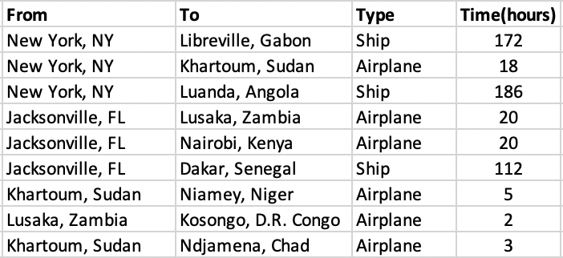

#### **To: Gail McGovern and Tadateru Konoe**  
  
#### **From: Ziyu Jin, Ningyun Yang**  
  
#### **Date: `r format(Sys.time(), '%B %d, %Y')`**   
  
#### **RE: Aiding Africa: Disaster/Disease Relief Plan**  

***


```{r setup, include=FALSE}
# Prepare the environment
knitr::opts_chunk$set(
	fig.width = 8.5,
	message = FALSE,
	warning = FALSE,
	# include = FALSE,
	echo = FALSE
)

options(tinytex.verbose = TRUE)

# Clear environment of variables and functions
rm(list = ls(all = TRUE)) 

# Clear environment of packages
if(is.null(sessionInfo()$otherPkgs) == FALSE) {
  lapply(paste("package:", names(sessionInfo()$otherPkgs), sep=""), 
         detach, character.only = TRUE, unload = TRUE)
}
```


```{r, warning=FALSE, message=FALSE}
# Load Packages
#install.packages("lpSolve")
#install.packages("lpSolveAPI")
library(lpSolve)
library(lpSolveAPI)
#library(tidyverse)
`%>%` <- magrittr::`%>%`
library(knitr)
library(kableExtra)
library(igraph)
```

Dear Mr. McGovern and Mr. Konoe,

Considering that African communities suffer from their lack of infrastructure, unstable government, and inadequate resources to cope with natural and health related disasters, we decided to develop aid disbursement plans for Africa. All the necessary workers and supplies will be assembled and sent from New York and Jacksonville, Florida to three IFRC strategic cities in Africa: Niamey in Niger, Kosongo in D.R. of the Congo, and Ndjamena in Chad. Since we do not know when the next disaster will occur we designed 3 different aid disbursement plans based on varying situations and conditions.

Thanks to Mr. Koneo's effort, we are able to use the ports and airfields in six African cities: Dakar, Senegal, Libreville, Gabon Luanda, Angola, Khartoum, Sudan, Lusaka, Zambia and Nairobi, Kenya as stops to refuel and resupply before heading to the three strategic cities. The map below shows the different routes workers and supplies may take to reach the African cities from the United States. (Cities are represented in abbreviations e.g. JF = Jacksonville, Florida, DS = Dakar, Senegal)


```{r}
# Problem 1 Network map
seer <- matrix(nc = 2, byrow = TRUE, 
              c(1, 3, 
                1, 4, 
                1, 5,
                1, 6,
                1, 7,
                1, 8,
                2, 3, 
                2, 4,
                2, 5,
                2, 6,
                2, 7,
                2, 8,
                3, 9, 
                3, 10, 
                3, 11, 
                4, 9, 
                4, 10,
                4, 11,
                5, 9, 
                5, 10,
                5, 11,
                6, 9, 
                6, 10,
                6, 11,
                7, 9, 
                7, 10,
                7, 11,
                8, 9, 
                8, 10,
                8, 11)) 

# Make graph by setting 11 nodes/vertices and edges  between nodes/vertices
g <- add_edges(make_empty_graph(n = 11, directed = FALSE), 
               t(seer[, 1:2])) %>%

  # Set vertice/node names 
  set_vertex_attr("name", value = c("NY","JF","DS","LG","LA","KS","LZ","NK","NN","KC","NC"))

# Set coordinates so looks similar to book diagram
  ## This is just for visualization, but could include it in data file
g$layout <- matrix(c(0,   0,   150, 150, 150, 170, 170, 170,  250, 250, 250,
                     150, 100, 200, 170, 140, 110,  80,  50,  180, 120, 60), nc = 2)

# Show network graph
plot(g)
```

The first plan is to enable workers and supplies to arrive at all the IFRC cities as quickly as possible assuming as many airplanes, ships, and trucks as necessary would be used to transfer workers and cargo from the United States to all nine cities. For this plan, we obtained the optimal routes by selecting the routes with the shortest times for workers and supplies to reach African city. There are significant bottlenecks in all the truck routes to the three strategic cities, which are significantly slow comparing to air travels. Below are the details of our quickest routes plan, where the time spent on each routes is displayed in hours.


```{r}
# Problem 2 Quickest routes
# Obtained by calculating the time spent on each route, i.e. distance/speed.

# Following are the quickest routes to each of the 9 cities:
#   NY-LG
#   NY-LA
#   NY-KS
#   JF-DS
#   JF-LZ
#   JF-NK
#   NY-KS-NN
#   NY-KS-NC
#   JF-LZ-KC

```

{width=500px}


Our second plan recognizes the cost of sending workers and supplies, so the plan is to get the needed workers and supplies to the nine cities at “minimum cost”. Furthermore, this plan fulfills the minimum requests from all the African cities as well as meeting their local restrictions on ground and air travels. Therefore, we proposed the following aid disbursement plan at the minimum cost of $310,861,299 (for easier planning, we converted the requests from numbers of workers, gallons of gasoline, etc., to tons of cargo):

+ Aid from New York will be transported by ship to Dakar, Libreville and Luanda at 50,000 tons, 280,000 tons and 130,000 tons respectively, in addition to the 40,000 tons to Lusaka sent through airplanes; 
+ Aid from Jacksonville will be transported by airplane to Khartoum, Lusaka and Nairobi at 220,000 tons, 110,000 tons and 170,000 tons respectively. 

When workers and supplies arrive in these six African cities, each city will keep the quantity of supplies according to its own needs. And The transportation route of the remaining supplies is arranged as follows: 

+ 180,000 tons supplies from Libreville will be transported by truck to Kosongo; 
+ Supplies from Khartoum will be transported to Niamey and Ndjamena by airplane at 100,000 tons and 30,000 tons respectively; 
+ 50,000 tons supplies from Nairobi will be transported by airplane Ndjamena.

The most significant bottleneck in the system that IFRC should consider resolving are:
+ Shipping constrainst from Khartoum to Ndjamena, where each additional capacity could reduce cost by $10,000.
+ Ban on truck route to Niamey. If it is feasible to develope truck routes there, we could also reduce some shipping costs.

Please refer to the graph below for the details of our second plan.

```{r results='hide'}
# Problem 3 Minimum cost

# Set up model
## Each variable is the number of planes/ships/trucks to be used for each routes
mc <- make.lp(0, 30)

## Set objective fn and constraints
obj_fn <- c(32, 30, 30, 45, 50, 55, 56, 48, 44, 49, 57, 61, 5, 5, 9, 3, 4, 7, 3, 5, 8, 22, 19, 4, 24, 22, 23, 28, 25, 2)
set.objfn(mc, obj_fn)

## Add constraints
add.constraint(mc, c( 240, 240, 240, 150, 150, 150, 0, 0, 0, 0, 0, 0, 0, 0, 0, 0, 0, 0, 0, 0, 0, 0, 0, 0, 0, 0, 0, 0, 0, 0), "=", 500000) #NY output
add.constraint(mc, c( 0, 0, 0, 0, 0, 0, 240, 240, 240, 150, 150, 150, 0, 0, 0, 0, 0, 0, 0, 0, 0, 0, 0, 0, 0, 0, 0, 0, 0, 0), "=", 500000) #JF output
add.constraint(mc, c( -240, 0, 0, 0, 0, 0, -240, 0, 0, 0, 0, 0, 17.7, 17.7, 17.7, 0, 0, 0, 0, 0, 0, 0, 0, 0, 0, 0, 0, 0, 0, 0), "=", -50000) #DS demand
add.constraint(mc, c( 0, -240, 0, 0, 0, 0, 0, -240, 0, 0, 0, 0, 0, 0, 0, 17.7, 17.7, 17.7, 0, 0, 0, 0, 0, 0, 0, 0, 0, 0, 0, 0), "=", -100000) #LG demand
add.constraint(mc, c( 0, 0, -240, 0, 0, 0, 0, 0, -240, 0, 0, 0, 0, 0, 0, 0, 0, 0, 17.7, 17.7, 17.7, 0, 0, 0, 0, 0, 0, 0, 0, 0), "=", -130000) #LA demand
add.constraint(mc, c( 0, 0, 0, -150, 0, 0, 0, 0, 0, -150, 0, 0, 0, 0, 0, 0, 0, 0, 0, 0, 0, 150, 150, 150, 0, 0, 0, 0, 0, 0), "=", -90000) #KS demand
add.constraint(mc, c( 0, 0, 0, 0, -150, 0, 0, 0, 0, 0, -150, 0, 0, 0, 0, 0, 0, 0, 0, 0, 0, 0, 0, 0,  150, 150, 150, 0, 0, 0), "=", -150000) #LZ demand
add.constraint(mc, c( 0, 0, 0, 0, 0, -150, 0, 0, 0, 0, 0, -150, 0, 0, 0, 0, 0, 0, 0, 0, 0, 0, 0, 0, 0, 0, 0,  150, 150, 150), "=", -120000) #NK demand
add.constraint(mc, c( 0, 0, 0, 0, 0, 0, 0, 0, 0, 0, 0, 0, -17.7, 0, 0, -17.7, 0, 0, -17.7, 0, 0, -150, 0, 0, -150, 0, 0, -150, 0, 0), "=", -100000) #NN demand
add.constraint(mc, c( 0, 0, 0, 0, 0, 0, 0, 0, 0, 0, 0, 0, 0, -17.7, 0, 0, -17.7, 0, 0, -17.7, 0, 0, -150, 0, 0, -150, 0, 0, -150, 0), "=", -180000) #KC demand
add.constraint(mc, c( 0, 0, 0, 0, 0, 0, 0, 0, 0, 0, 0, 0, 0, 0, -17.7, 0, 0, -17.7, 0, 0, -17.7, 0, 0, -150, 0, 0, -150, 0, 0, -150), "=", -80000) #NC demand
add.constraint(mc, c( 0, 0, 0, 0, 0, 0, 0, 0, 0, 0, 0, 0, 1, 0, 0, 0, 0, 0, 0, 0, 0, 0, 0, 0, 0, 0, 0, 0, 0, 0), "<=", 0) # DS NN truck forbidden
add.constraint(mc, c( 0, 0, 0, 0, 0, 0, 0, 0, 0, 0, 0, 0, 0, 0, 0, 1, 0, 0, 0, 0, 0, 0, 0, 0, 0, 0, 0, 0, 0, 0), "<=", 0) # LG NN truck forbidden
add.constraint(mc, c( 0, 0, 0, 0, 0, 0, 0, 0, 0, 0, 0, 0, 0, 0, 0, 0, 0, 0, 1, 0, 0, 0, 0, 0, 0, 0, 0, 0, 0, 0), "<=", 0) # LA NN truck forbidden
add.constraint(mc, c( 0, 0, 0, 0, 0, 0, 0, 0, 0, 0, 0, 0, 0, 0, 1, 0, 0, 0, 0, 0, 0, 0, 0, 0, 0, 0, 0, 0, 0, 0), "<=", 840) # DS NC truck restriction
add.constraint(mc, c( 0, 0, 0, 0, 0, 0, 0, 0, 0, 0, 0, 0, 0, 0, 0, 0, 0, 1, 0, 0, 0, 0, 0, 0, 0, 0, 0, 0, 0, 0), "<=", 840) # LG NC truck restriction
add.constraint(mc, c( 0, 0, 0, 0, 0, 0, 0, 0, 0, 0, 0, 0, 0, 0, 0, 0, 0, 0, 0, 0, 1, 0, 0, 0, 0, 0, 0, 0, 0, 0), "<=", 840) # LA NC truck restriction
add.constraint(mc, c( 0, 0, 0, 0, 0, 0, 0, 0, 0, 0, 0, 0, 0, 0, 0, 0, 0, 0, 0, 0, 0, 0, 0, 1, 0, 0, 0, 0, 0, 0), "<=", 200) # KS NC  air restriction
add.constraint(mc, c( 0, 0, 0, 0, 0, 0, 0, 0, 0, 0, 0, 0, 0, 0, 0, 0, 0, 0, 0, 0, 0, 0, 0, 0, 0, 0, 1, 0, 0, 0), "<=", 200) # LZ NC air restriction


## Add names
dimnames(mc) <- list(c("NY", "JF","DS", "LG", "LA", "KS", "LZ", "NK", "NN", "KC", "NC", "UDS-NN", "ULG-NN", "ULA_NN", "UDS-NC","ULG-NC","ULA-NC","UKS-NC","ULZ-NC"), 
                      c("NY-DS", "NY-LG", "NY-LA", "NY-KS", "NY-LZ", "NY-NK", "JF-DS", "JF-LG", "JF-LA", "JF-KS", "JF-LZ", "JF-NK", "DS-NN", "DS-KC", "DS-NC", "LG-NN", "LG-KC", "LG-NC", "LA-NN", "LA-KC", "LA-NC", "KS-NN", "KS-KC", "KS-NC", "LZ-NN", "LZ-KC", "LZ-NC", "NK-NN", "NK-KC", "NK-NC"))


# Write to view the algebraic formulation
write.lp(mc, "mc.lp",type = 'lp')


# Solve the model
solve(mc)


# Make results and sensitivity table 
ps <- get.primal.solution(mc)

## Get sensitivity analysis
obj_sa <- get.sensitivity.obj(mc)
rhs_sa <- get.sensitivity.rhs(mc)

n <- length(get.variables(mc))
m <- length(get.constr.type(mc))
ov <- paste0("Objective Value = ", ps[1])

sa_tab <- rbind(ps[2:(n + m + 1)], 
                c(round(rhs_sa$duals[1:m], 2), obj_fn),
                round(c(rhs_sa$dualsfrom[1:m],obj_sa$objfrom), 2),
                round(c(rhs_sa$dualstill[1:m],obj_sa$objtill), 2)) 
colnames(sa_tab) <- c(rownames(mc), colnames(mc))
rownames(sa_tab) <- c("solution", "duals/coef", "Sens From", "Sens Till")      

## Substitute "inf" and "-inf" so tables are easier to read (coded by two classmates!)
sa_tab <- ifelse(sa_tab == -1.000e+30, "-inf", sa_tab)
sa_tab <- ifelse(sa_tab == 1.000e+30, "inf", sa_tab)

## Print the table
kable(sa_tab, format.args = list(big.mark = ",")) %>%
  kable_styling(bootstrap_options = c("striped", "bordered")) %>% 
  add_footnote(label = ov, notation = "none")

```

{width=700px}


For our third plan, we considered several additional restrictions from Africa, such as limited number of planes may be sent between any two cities and limited number of trucks can travel between certain ports and African cities. However, the additional restrictions will prevent the IRFC from satisfying all the supply requirements of the IFRC cities. Therefore, we decide to disregard cost and instead maximize the total amount of cargo to the IFRC cities. As the a result, we porposed our third plan as follows: 

+ The total amount of cargo can be delivered to Africa is 816,170 tons, where 500,000 tons are sent from New York and 316,170 tons are sent from Jacksonville.
+ Out of the 500,000 tons of aid from New York, 79,185, 108,142 and 138,673 tons will arrive at to Dakar, Libreville and Luanda by ship respectively; 63,000, 45,000, and 66,000 tons will be distributed to Khartoum, Lusaka and Nairobi via airplanes respectively; 
+ Aid from Jacksonville will be transported by airplane to Khartoum, Lusaka and Nairobi at 90,000, 75,000, and 105,000 tons respectively, in addition to the 46,170 tons to Dakar that will be sent through ships.

Please refer to the graph below for the amount of cargo to remain in the transfer cities as well as the transportation plans of cargo to be sent to the three strategic cities.

We are facing some bottlenecks in this plan as well: 

+ The air restrictions from New York and Jacksonville to Lusaka resulted our failure to meet its minimum requirement.
+ Restritions on the truck routes and the air travels from the transfer cities (except for Lusaka) to Kosongo and Ndjamena again prevented us to meet their requests for aid.


```{r results='hide'}
# Problem 4 Max flow

# Set up model
## Each variable is the amount of cargos to be shipped in each routes
mxf <- make.lp(0, 30)


## Set objective fn 
obj_fn <- c(1, 1, 1, 1, 1, 1, 1, 1, 1, 1, 1, 1, 0, 0, 0, 0, 0, 0, 0, 0, 0, 0, 0, 0, 0, 0, 0, 0, 0, 0)
set.objfn(mxf, obj_fn)

## Run as max
lp.control(mxf, sense = "max")

## Add constraints
add.constraint(mxf, c( 1, 1, 1, 1, 1, 1, 0, 0, 0, 0, 0, 0, 0, 0, 0, 0, 0, 0, 0, 0, 0, 0, 0, 0, 0, 0, 0, 0, 0, 0), "<=", 500000) #NY output
add.constraint(mxf, c( 0, 0, 0, 0, 0, 0, 1, 1, 1, 1, 1, 1, 0, 0, 0, 0, 0, 0, 0, 0, 0, 0, 0, 0, 0, 0, 0, 0, 0, 0), "<=", 500000) #JF output
add.constraint(mxf, c( -1, 0, 0, 0, 0, 0, -1, 0, 0, 0, 0, 0, 1, 1, 1, 0, 0, 0, 0, 0, 0, 0, 0, 0, 0, 0, 0, 0, 0, 0), ">=", -50000) #DS demand
add.constraint(mxf, c( 0, -1, 0, 0, 0, 0, 0, -1, 0, 0, 0, 0, 0, 0, 0, 1, 1, 1, 0, 0, 0, 0, 0, 0, 0, 0, 0, 0, 0, 0), ">=", -100000) #LG demand
add.constraint(mxf, c( 0, 0, -1, 0, 0, 0, 0, 0, -1, 0, 0, 0, 0, 0, 0, 0, 0, 0, 1, 1, 1, 0, 0, 0, 0, 0, 0, 0, 0, 0), ">=", -130000) #LA demand
add.constraint(mxf, c( 0, 0, 0, -1, 0, 0, 0, 0, 0, -1, 0, 0, 0, 0, 0, 0, 0, 0, 0, 0, 0, 1, 1, 1, 0, 0, 0, 0, 0, 0), ">=", -90000) #KS demand
add.constraint(mxf, c( 0, 0, 0, 0, -1, 0, 0, 0, 0, 0, -1, 0, 0, 0, 0, 0, 0, 0, 0, 0, 0, 0, 0, 0, 1, 1, 1, 0, 0, 0), ">=", -150000) #LZ demand
add.constraint(mxf, c( 0, 0, 0, 0, 0, -1, 0, 0, 0, 0, 0, -1, 0, 0, 0, 0, 0, 0, 0, 0, 0, 0, 0, 0, 0, 0, 0, 1, 1, 1), ">=", -120000) #NK demand
add.constraint(mxf, c( 0, 0, 0, 0, 0, 0, 0, 0, 0, 0, 0, 0, -1, 0, 0, -1, 0, 0, -1, 0, 0, -1, 0, 0, -1, 0, 0, -1, 0, 0), ">=", -100000) #NN demand
add.constraint(mxf, c( 0, 0, 0, 0, 0, 0, 0, 0, 0, 0, 0, 0, 0, -1, 0, 0, -1, 0, 0, -1, 0, 0, -1, 0, 0, -1, 0, 0, -1, 0), ">=", -180000) #KC demand
add.constraint(mxf, c( 0, 0, 0, 0, 0, 0, 0, 0, 0, 0, 0, 0, 0, 0, -1, 0, 0, -1, 0, 0, -1, 0, 0, -1, 0, 0, -1, 0, 0, -1), ">=", -80000) #NC demand

add.constraint(mxf, c( 0, 0, 0, 1, 0, 0, 0, 0, 0, 0, 0, 0, 0, 0, 0, 0, 0, 0, 0, 0, 0, 0, 0, 0, 0, 0, 0, 0, 0, 0), "<=", 500 * 150) #NY-KS air restriction 500 * 150
add.constraint(mxf, c( 0, 0, 0, 0, 1, 0, 0, 0, 0, 0, 0, 0, 0, 0, 0, 0, 0, 0, 0, 0, 0, 0, 0, 0, 0, 0, 0, 0, 0, 0), "<=", 300 * 150) #NY-LZ air restriction 300 * 150
add.constraint(mxf, c( 0, 0, 0, 0, 0, 1, 0, 0, 0, 0, 0, 0, 0, 0, 0, 0, 0, 0, 0, 0, 0, 0, 0, 0, 0, 0, 0, 0, 0, 0), "<=", 500 * 150) #NY-NK air restriction 500 * 150
add.constraint(mxf, c( 0, 0, 0, 0, 0, 0, 0, 0, 0, 1, 0, 0, 0, 0, 0, 0, 0, 0, 0, 0, 0, 0, 0, 0, 0, 0, 0, 0, 0, 0), "<=", 600 * 150) #JF-KS air restriction 600 * 150
add.constraint(mxf, c( 0, 0, 0, 0, 0, 0, 0, 0, 0, 0, 1, 0, 0, 0, 0, 0, 0, 0, 0, 0, 0, 0, 0, 0, 0, 0, 0, 0, 0, 0), "<=", 500 * 150) #JF-LZ air restriction 500 * 150
add.constraint(mxf, c( 0, 0, 0, 0, 0, 0, 0, 0, 0, 0, 0, 1, 0, 0, 0, 0, 0, 0, 0, 0, 0, 0, 0, 0, 0, 0, 0, 0, 0, 0), "<=", 700 * 150) #JF-NK air restriction 700 * 150

add.constraint(mxf, c( 0, 0, 0, 0, 0, 0, 0, 0, 0, 0, 0, 0, 0, 1, 0, 0, 0, 0, 0, 0, 0, 0, 0, 0, 0, 0, 0, 0, 0, 0), "<=", 700 * 17.7) #DS-KC Truck restriction 700 * 17.7
add.constraint(mxf, c( 0, 0, 0, 0, 0, 0, 0, 0, 0, 0, 0, 0, 0, 0, 1, 0, 0, 0, 0, 0, 0, 0, 0, 0, 0, 0, 0, 0, 0, 0), "<=", 450* 17.7) #DS-NC truck restriction 450* 17.7
add.constraint(mxf, c( 0, 0, 0, 0, 0, 0, 0, 0, 0, 0, 0, 0, 0, 0, 0, 0, 1, 0, 0, 0, 0, 0, 0, 0, 0, 0, 0, 0, 0, 0), "<=", 300 * 17.7) #LG-KC truck restriction 300 * 17.7
add.constraint(mxf, c( 0, 0, 0, 0, 0, 0, 0, 0, 0, 0, 0, 0, 0, 0, 0, 0, 0, 1, 0, 0, 0, 0, 0, 0, 0, 0, 0, 0, 0, 0), "<=", 160 * 17.7) #LG-NC truck restriction 160 * 17.7
add.constraint(mxf, c( 0, 0, 0, 0, 0, 0, 0, 0, 0, 0, 0, 0, 0, 0, 0, 0, 0, 0, 0, 1, 0, 0, 0, 0, 0, 0, 0, 0, 0, 0), "<=", 250 * 17.7) #LA-KC truck restriction 250 * 17.7
add.constraint(mxf, c( 0, 0, 0, 0, 0, 0, 0, 0, 0, 0, 0, 0, 0, 0, 0, 0, 0, 0, 0, 0, 1, 0, 0, 0, 0, 0, 0, 0, 0, 0), "<=", 240 * 17.7) #LA-NC truck restriction 240 * 17.7

add.constraint(mxf, c( 0, 0, 0, 0, 0, 0, 0, 0, 0, 0, 0, 0, 0, 0, 0, 0, 0, 0, 0, 0, 0, 1, 0, 0, 0, 0, 0, 0, 0, 0), "<=", 300 * 150) #KS-NN air restriction 300 * 150
add.constraint(mxf, c( 0, 0, 0, 0, 0, 0, 0, 0, 0, 0, 0, 0, 0, 0, 0, 0, 0, 0, 0, 0, 0, 0, 1, 0, 0, 0, 0, 0, 0, 0), "<=", 80 * 150) #KS-KC air restriction 80 * 150
add.constraint(mxf, c( 0, 0, 0, 0, 0, 0, 0, 0, 0, 0, 0, 0, 0, 0, 0, 0, 0, 0, 0, 0, 0, 0, 0, 1, 0, 0, 0, 0, 0, 0), "<=", 40 * 150) #KS-NC air restriction 40 * 150
add.constraint(mxf, c( 0, 0, 0, 0, 0, 0, 0, 0, 0, 0, 0, 0, 0, 0, 0, 0, 0, 0, 0, 0, 0, 0, 0, 0, 1, 0, 0, 0, 0, 0), "<=", 200 * 150) #LZ-NN air restriction 200 * 150
add.constraint(mxf, c( 0, 0, 0, 0, 0, 0, 0, 0, 0, 0, 0, 0, 0, 0, 0, 0, 0, 0, 0, 0, 0, 0, 0, 0, 0, 1, 0, 0, 0, 0), "<=", 140 * 150) #LZ-KC air restriction 140 * 150
add.constraint(mxf, c( 0, 0, 0, 0, 0, 0, 0, 0, 0, 0, 0, 0, 0, 0, 0, 0, 0, 0, 0, 0, 0, 0, 0, 0, 0, 0, 1, 0, 0, 0), "<=", 0) #LZ-NC air restriction 0 * 150
add.constraint(mxf, c( 0, 0, 0, 0, 0, 0, 0, 0, 0, 0, 0, 0, 0, 0, 0, 0, 0, 0, 0, 0, 0, 0, 0, 0, 0, 0, 0, 1, 0, 0), "<=", 0) #NK-NN air restriction 0 * 150
add.constraint(mxf, c( 0, 0, 0, 0, 0, 0, 0, 0, 0, 0, 0, 0, 0, 0, 0, 0, 0, 0, 0, 0, 0, 0, 0, 0, 0, 0, 0, 0, 1, 0), "<=", 40 * 150) #NK-KC air restriction 40 * 150
add.constraint(mxf, c( 0, 0, 0, 0, 0, 0, 0, 0, 0, 0, 0, 0, 0, 0, 0, 0, 0, 0, 0, 0, 0, 0, 0, 0, 0, 0, 0, 0, 0, 1), "<=", 300 * 150) #NK-NC air restriction 300 * 150


## Add names
dimnames(mxf) <- list(c("NY", "JF","DS", "LG", "LA", "KS", "LZ", "NK", "NN", "KC", "NC", "U(NY-KS)", "U(NY-LZ)", "U(NY-NK)", "U(JF-KS)", "U(JF-LZ)", "U(JF-NK)", "U(DS-KC)", "U(DS-NC)", "U(LG-KC)", "U(LG-NC)", "U(LA-KC)", "U(LA-NC)", "U(KS-NN)", "U(KS-KC)", "U(KS-NC)", "U(LZ-NN)", "U(LZ-KC)", "U(LZ-NC)", "U(NK-NN)", "U(NK-KC)", "U(NK-NC)"), 
                      c("NY-DS", "NY-LG", "NY-LA", "NY-KS", "NY-LZ", "NY-NK", "JF-DS", "JF-LG", "JF-LA", "JF-KS", "JF-LZ", "JF-NK", "DS-NN", "DS-KC", "DS-NC", "LG-NN", "LG-KC", "LG-NC", "LA-NN", "LA-KC", "LA-NC", "KS-NN", "KS-KC", "KS-NC", "LZ-NN", "LZ-KC", "LZ-NC", "NK-NN", "NK-KC", "NK-NC"))

# Write to view the algebraic formulation
write.lp(mxf, "mxf.lp",type = 'lp')

# Solve the model
solve(mxf)

# Make solution/sensitivity analysis table
## Get primal solution
ps <- get.primal.solution(mxf)

## Get sensitivity analysis
obj_sa <- get.sensitivity.obj(mxf)
rhs_sa <- get.sensitivity.rhs(mxf)

n <- length(get.variables(mxf))
m <- length(get.constr.type(mxf))
ov <- paste0("Objective Value = ", ps[1])

sa_tab <- rbind(ps[2:(n + m + 1)], 
                c(round(rhs_sa$duals[1:m], 2), obj_fn),
                round(c(rhs_sa$dualsfrom[1:m],obj_sa$objfrom), 2),
                round(c(rhs_sa$dualstill[1:m],obj_sa$objtill), 2)) 
colnames(sa_tab) <- c(rownames(mxf), colnames(mxf))
rownames(sa_tab) <- c("solution", "duals/coef", "Sens From", "Sens Till")      

## Substitute "inf" and "-inf" so tables are easier to read (coded by two classmates!)
sa_tab <- ifelse(sa_tab == -1.000e+30, "-inf", sa_tab)
sa_tab <- ifelse(sa_tab == 1.000e+30, "inf", sa_tab)

## Print the table
kable(sa_tab, format.args = list(big.mark = ",")) %>%
  kable_styling(bootstrap_options = c("striped", "bordered")) %>% 
  add_footnote(label = ov, notation = "none")
```

{width=700px}


At this point, we have introduced all 3 aid disbursement plans we designed to match different needs and restrictions of the African cities. The first plan aims to transport workers and supplies in the shortest time disregarding any costs or cargo limitations. The second plan is the most cost-efficient one in that it minimizes the transporation costs while meeting the minimum demand of all the African cities. The last plan is designed to distrubute as many workers and supplies as possible disregarding the costs but is constrained by additional restrictions.

Please select the most suitable plan to carry out according to the above instruction. We invite you to refer to the technical appendix or contact us directly should you have any concerns regarding the findings and recommendations. 


Best regards, 

Ziyu Jin and Ningyun Yang


